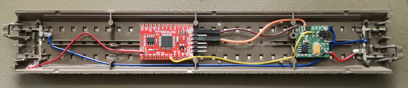

# FunkGBM (beta)

Ein Gleisbesetztmelder, der ins C-Gleis eingebaut werden kann und den Besetztzustand
ohne Kabel an die Zentrale meldet.

Die Hardware besteht aus:
- ATmega328p Prozessor (Arduino)
- Strommessung als Spannungsabfall an zwei Schottky-Dioden
- RFM69 Modul zur Datenübertragung (868MHz)
- Flash-Memory zur OTA (over-the-air) Softwareaktualisierung

(basiert auf dem "Moteino" von LowPowerLab)

Vorteile:
* keine Kabel
* Sw-Updates über Funk möglich

Nachteile:
* vergleichsweise teuer

Funk_GBM Prototyp im C-Gleis</img>

siehe auch <a href="http://opensx.net/funkgbm">Funk-GBM auf opensx.net</a>
