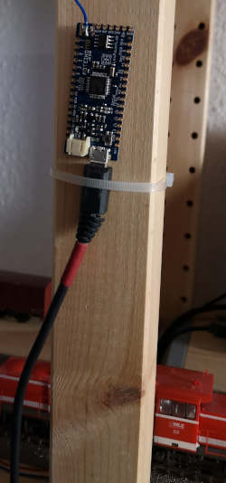

# Software zum FunkGBM (beta)

## GBM_Moteino
Arduino-Sketch für die Hardware, die im Gleis sitzt (GBM_RFM69 mit ATmega328p)

## GBM_Gateway_M0
Gateway-Hardware (in diesem Fall ein Arduino-M0 von LowPowerLab),
 die die empfangenen Pakete über USB an den PC weiterreicht.
 

 
## MoteinoRead
Ein Processing Sketch, der die am Gateway empfangenen Daten visualisiert und  
 per TCP als "Sensor-Message" an das Loconet  bzw den "LbServer" weiterreicht.
 
 Ausserdem zeigt eine kleine Grafik, welche Sensoren gerade belegt sind, wie die 
 Empfangsqualität (RSSI) ist und welche Software-Version der FunkGBM hat. Bei 
 neuerer Hardware wird auch die Spannung am Gleis gemessen und zusammen mit der 
 Software-Version angezeigt.

